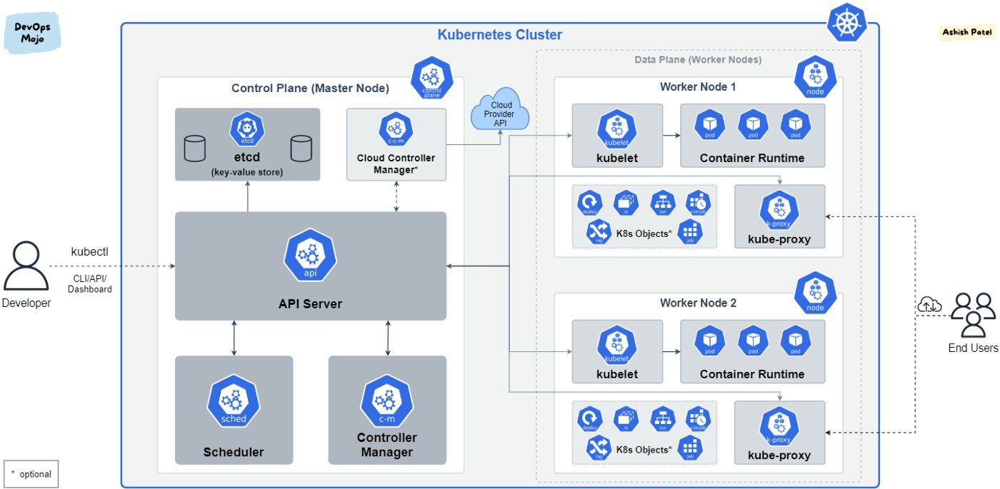
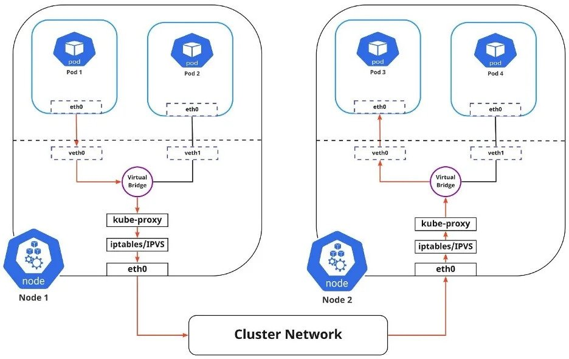
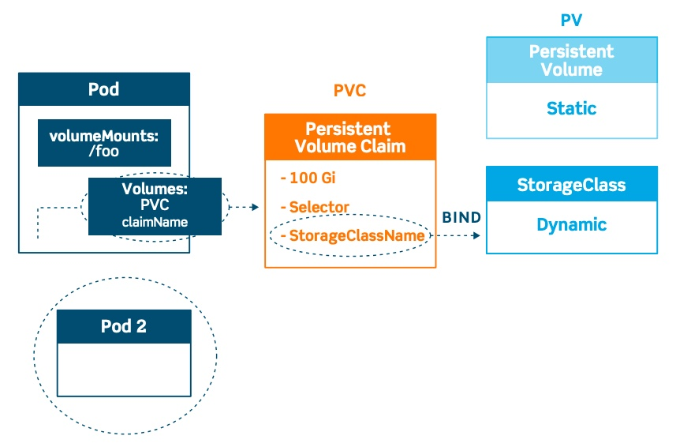
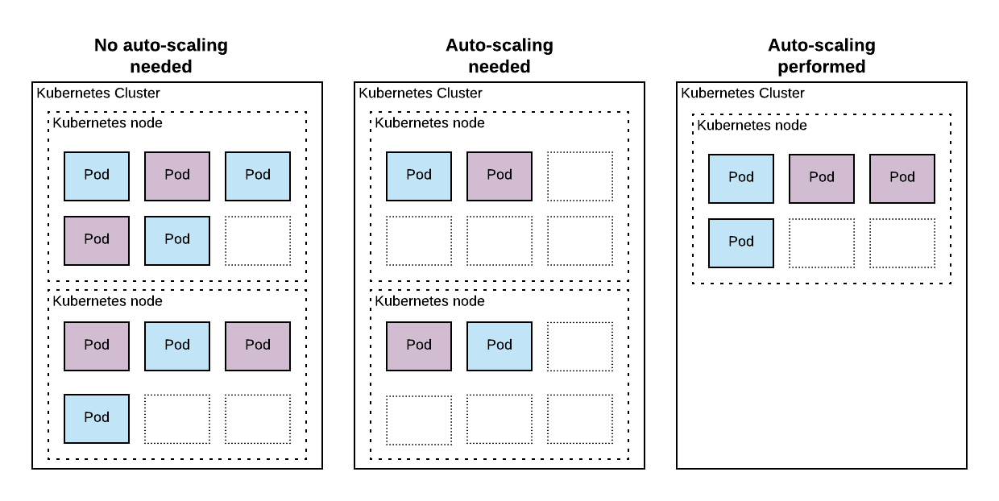

# INTRODUCTION KUBERNETES
### **Kubernetes** groups containers that make up an application into logical units for easy management and discovery.
`minikube` is local Kubernetes, `GKS` (Google K8s Service), `AKS` (Azure K8s Service), `EKS` (Amazon Elastic K8s Service), etc. \
`minikube` can be deployed as a VM, a container, or bare-metal

## 1. Install minikube as a container
### 1.1 Install Docker
Follow this [instruction](https://docs.docker.com/engine/install/ubuntu/)

### 1.2 Install minikube
#### Update system
    sudo apt update
    sudo apt install apt-transport-https
    sudo apt upgrade

#### Download minikube on Ubuntu 22.04|20.04|18.04
    wget https://storage.googleapis.com/minikube/releases/latest/minikube-linux-amd64
    chmod +x minikube-linux-amd64
    sudo mv minikube-linux-amd64 /usr/local/bin/minikube

#### Confirm version installed
    minikube version

#### Install kubectl on Ubuntu
    curl -LO https://storage.googleapis.com/kubernetes-release/release/`curl -s https://storage.googleapis.com/kubernetes-release/release/stable.txt`/bin/linux/amd64/kubectl
    
    chmod +x ./kubectl
    sudo mv ./kubectl /usr/local/bin/kubectl

## 2. Basic component of kubernetes

- Cluster: group of nodes
- Nodes/Worker: local machine
- Pod: group of container
- API server: exposes the k8s API
- etcd: store for all cluster data
- Scheduler: watches pod
- Kubelet: makes sure that containers are running in a Pod
- Proxy: maintains network rules on nodes
- Deployment: creates a management object one level higher than a replica set, and enables you to deploy and manage updates for pods in a cluster.
- ReplicaSet: maintain a stable set of replica Pods (Identical Pods) running at any given time.
- Service: provides stable networking for pods by bringing stable IP addresses and DNS names, …
- ConfigMaps: used to store non-confidential data in key-value pairs (environment variables, command-line arguments, or as configuration files in a volume)
- Secret: store and manage a small amount of sensitive information such as passwords, tokens, keys, SSH keys, etc.

## 3. Getting start K8s

## 4. Manage resource on kubernetes
- Resource Units
    - CPU: millicpus (sometimes called millicores)
    - Memory: mebibytes (MiB)
- Resource Requests:
    A Kubernetes resource request specifies the minimum amount of that resource that the Pod needs to run.
- Resource Limits:
    A resource limit specifies the maximum amount of resource that a Pod is allowed to use.

## 5. Manage network on kubernetes

Types of Kubernetes services
- ClusterIP. Exposes a service which is only accessible from within the cluster.
- NodePort. Exposes a service via a static port on each node’s IP.
- LoadBalancer. Exposes the service via the cloud provider’s load balancer.
- ExternalName. Maps a service to a predefined externalName field by returning a value for the CNAME record.

## 6. Manage volume on kubernetes

Types of Kubernetes Volume

- emptyDir − It is a type of volume that is created when a Pod is first assigned to a Node. It remains active as long as the Pod is running on that node. The volume is initially empty and the containers in the pod can read and write the files in the emptyDir volume. Once the Pod is removed from the node, the data in the emptyDir is erased.

- hostPath − This type of volume mounts a file or directory from the host node’s filesystem into your pod.
- nfs − An nfs volume allows an existing NFS (Network File System) to be mounted into your pod. The data in an nfs volume is not erased when the Pod is removed from the node. The volume is only unmounted.

Persistent Volume (PV) − It’s a piece of network storage that has been provisioned by the administrator. It’s a resource in the cluster which is independent of any individual pod that uses the PV.

Persistent Volume Claim (PVC) − The storage requested by Kubernetes for its pods is known as PVC. The user does not need to know the underlying provisioning. The claims must be created in the same namespace where the pod is created.

## 7. Automating deployment and scale

Auto-scaling is a method that allows you to automatically create and destroy your resources (servers, containers, anything else you might need) based on different automated rules.

Without auto-scaling, you would need to create resources to handle the peak traffic that you would receive during the day. With auto-scaling, you can create these resources when they are needed, and delete them when they are idle. This could potentially save you (a lot of) money.